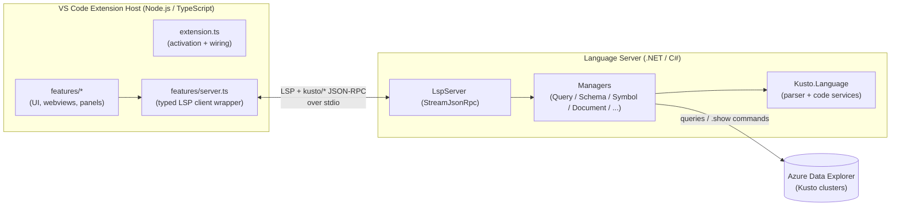
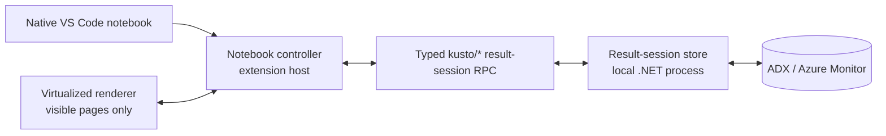
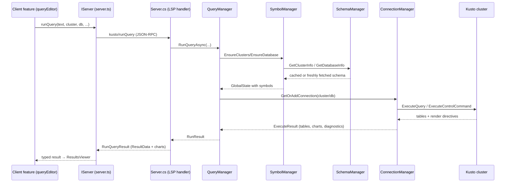

# Architecture Overview

This document explains how the Kusto Explorer for VS Code extension is put together: its major
components, how they communicate, and the design intent behind the structure. It is aimed at
contributors who need to understand *why* the code is shaped the way it is before changing it.

For build/debug/packaging steps see [CONTRIBUTING.md](CONTRIBUTING.md). For the end-user feature
walkthrough see the [User Guide](src/Client/README.md).

---

## 0. What this product is

The Kusto VS Code extension is meant to **mimic the desktop Kusto Explorer application, but running
inside VS Code**. Its initial focus is the core loop of that experience:

- basic editing of **multi-query KQL files**,
- **executing queries**, and
- **displaying results as tables and charts**.

Several features are deliberately modeled on their desktop Kusto Explorer equivalents — for example
**scratch pads** and **query history** exist to reflect the same concepts users already know from the
desktop app.

**Scope is intentionally partial.** Not every desktop Kusto Explorer feature has a representation in
the extension today. Which capabilities the extension gains in the future depends on **feedback from
the community** rather than a fixed roadmap. When weighing a change, favor parity with the desktop
experience where it makes sense, and treat the desktop app as the reference point for how a feature
"should" feel.

**The relationship isn't one-way, though** — some capabilities are *new to the extension* and have no
desktop Kusto Explorer equivalent:

- **Saving results as `.kqr` files** — a result set can be saved to a shareable file that can be
  reopened and viewed later, independent of re-running the query.
- **The chart editor** — an interactive UI for customizing a chart (type, axes, series, title, etc.)
  rather than being limited to whatever the query specified.
- **Charting without the `render` operator** — charts can be created directly from query results in
  the UI, so visualizing data doesn't require adding a `render`/chart operator to the KQL.

So the extension is best understood as "desktop Kusto Explorer's core experience, brought into
VS Code, plus a few VS Code-native conveniences" — not a strict subset.

**A primary motivation for being in VS Code at all is AI.** Bringing the Kusto Explorer experience
into VS Code gives users direct access to **AI agents (e.g. Copilot) that can see, create, edit, and
run their queries** in context. The editor host already understands the active `.kql` document, the
connected cluster/database, and the schema, so an agent can be wired into that same context to author
and diagnose KQL alongside the user. Beyond the document, the agent is given a set of **Kusto tools**
that let it understand and explore schemas (clusters, databases, tables, columns, functions),
**run queries**, and even **render charts** for the results it gets back — so it can investigate the
data the way a user would, not just write text. This is exposed through the language-model tools
registered in [src/Client/features/copilot.ts](src/Client/features/copilot.ts) (see §3.3), and it is
a first-class reason the product lives here rather than only on the desktop.

---

## 1. The big picture: a two-process extension

The extension is split into two cooperating processes that talk over the **Language Server Protocol
(LSP)** plus a set of **custom Kusto JSON-RPC methods**:



### Why two processes?

- **Performance, not availability, is the real reason.** A JavaScript translation of the Kusto parser
  (`Kusto.Language`) exists and is used by other web-based editors, so running the language services
  in-process in the Node extension host was entirely possible. The native .NET build was chosen
  because parsing and semantic analysis run roughly **50x faster** in a .NET process than the
  JavaScript version does. That speed difference is what keeps typing responsive on large queries (or
  queries that are *indirectly* large — e.g. small text that expands against a big schema), where the
  parser is re-running constantly as the user types.
- **The UI must live in the VS Code extension host (Node).** Webviews, tree views, commands, and the
  Activity Bar are all JavaScript surfaces, so a separate host process is unavoidable regardless of
  where parsing happens.
- **LSP is the natural seam.** Standard editor features (completion, hover, diagnostics, formatting,
  go-to-definition, rename, semantic tokens) map directly onto LSP. Everything Kusto-specific that
  doesn't fit LSP (running queries, fetching schema, decoding connection strings) is added as custom
  `kusto/*` JSON-RPC methods over the same channel.

### The `NullServer` fallback (a test affordance, not a usage mode)

`IServer` has a `NullServer` implementation (see
[src/Client/features/server.ts](src/Client/features/server.ts)) that returns safe defaults. If .NET
or `Server.dll` is unavailable, `extension.ts` substitutes it so the extension still activates and UI
features still register.

**This exists purely to let unit/integration tests run without standing up a full .NET language
server — it is not a supported end-user mode.** With `NullServer` in place there is no real language
intelligence (completion, diagnostics, query execution, schema), so it is only useful for exercising
the client's UI wiring in isolation. Don't design features around it as if it were a degraded-but-
functional runtime; treat a missing server as a test/dev condition, not a shipping configuration.

### A note on history: from "an LSP server" to "a VS Code extension"

The project began as an attempt to build a **general-purpose Kusto LSP server** that any editor could
host. As it evolved, so many VS Code-specific capabilities (webview-based results and charts, the
connections tree, scratch pads, history, host-bridged authentication, etc.)
improved the experience that the LSP server increasingly needed *custom*, non-standard communication
to support them. At that point the focus deliberately shifted from "a portable language server" to
"a good VS Code extension."

The architecture still rests on the LSP infrastructure, and that is intentional: for the parts the
server genuinely does — the standard editor language services — LSP does the job well enough that a
custom protocol would add nothing. So LSP remains the backbone for those features, while the
Kusto-specific work that LSP doesn't model is layered on as custom `kusto/*` JSON-RPC methods over
the same channel. **Practical consequence:** don't treat editor-agnosticism as a hard design
constraint — the codebase optimizes for the VS Code experience first, and reuses LSP where it pays
its own way rather than for portability's sake.

---

## 2. Repository layout

| Path | Description |
|------|-------------|
| `KustoExplorerVscode.slnx` | Visual Studio solution spanning the whole extension |
| `src/Client` | TypeScript VS Code extension — UI, LSP client, all editor-host features |
| `src/Server` | C# LSP server — Kusto parser integration and language/query services |
| `src/ServerTests` | C# tests for the server |
| `src/Client/tests` | TypeScript unit (`vitest`) and integration tests |

The client `package.json` declares all VS Code contributions (commands, menus, views, settings,
the `kusto` language, the scratch-pad/entity-definition URI schemes). The build (`npm run compile`)
uses **esbuild**; the debug server is produced by `build-debug-server`.

---

## 3. The Client (TypeScript extension host)

### 3.1 Activation and wiring — `extension.ts`

[src/Client/extension.ts](src/Client/extension.ts) is the composition root. It:

1. Creates the `Kusto` output channel early.
2. Tries to launch the .NET language server (`dotnet Server.dll vscode`) via
   `vscode-languageclient`. On success it wraps the `LanguageClient` in the typed `Server` class;
   on failure it uses `NullServer`.
3. Constructs every feature object, injecting the shared `IServer`, `ConnectionManager`,
   `Clipboard`, etc., and registers their commands on the extension context.
4. Returns a small object of internals (`historyManager`, `connectionManager`, `resultsViewer`,
   `server`) so **integration tests** can drive the extension.

**Design intent:** dependencies flow one way — `extension.ts` builds the graph and hands
collaborators down by constructor injection. Features depend on the `IServer` *interface*, never on
the concrete `LanguageClient`, which keeps them testable and server-agnostic.

### 3.2 The typed server seam — `features/server.ts`

`IServer` is the single typed contract for everything the client asks of the language server:
`runQuery`, `getQueryResultType`, `getDatabaseInfo`, `validateQuery`, `refreshSchema`, entity and
paste helpers, plus notifications in both directions. The concrete `Server`:

- Centralizes every custom `kusto/*` request so return-type signatures live in one place.
- **Bridges host capabilities back to the server** via `client.onRequest` handlers:
  - `kusto/getData` / `kusto/setData` → VS Code `globalState` (lets the server persist across
    sessions without owning storage).
  - `kusto/getAuthenticationToken` → VS Code's built-in Microsoft authentication. **Design intent:**
    sign-in UI lives in the host window, not in the server process, which avoids
    "non-interactive environment" failures on remote-SSH / WSL / Codespaces and gives users one place
    (the Accounts gear) to manage credentials.

`NullServer` implements the same interface with no-ops/defaults.

### 3.3 Feature modules — `features/*`

Features are grouped by responsibility. Key ones:

| Area | Modules | Responsibility |
|------|---------|----------------|
| **Connections** | `connectionManager.ts`, `connectionsPanel.ts`, `connectionStatusBar.ts`, `authentication.ts` | Persist clusters/groups (in `globalState`) and per-document cluster/database assignments (in `workspaceState`); render the Connections tree; show the active connection in the status bar; acquire AAD tokens. |
| **Query editing** | `queryEditor.ts`, `markdown.ts` | Run/format/copy queries; CodeLens-driven selection; paste transforms; document schema refresh. |
| **Results** | `resultsViewer.ts`, `dataTableProvider.ts`, `webview.ts`, `html.ts`, `tsv.ts` | Display query results in webviews; tabular grid (`simple-datatables`); copy/export; drag-and-drop as `datatable` expressions. |
| **Charts** | `chartProvider.ts`, `compositeChartProvider.ts`, `chartEditorProvider.ts`, `plotlyChartProvider.ts`, `graphChartProvider.ts`, `timePivotChartProvider.ts` | Render and edit charts from results; save as `.kqr`; copy as image. |
| **Scratch pads** | `scratchPadManager.ts`, `scratchPadPanel.ts` | In-memory `.kql` documents (custom `kusto-scratchpad:` scheme) that need no file on disk. |
| **History** | `historyManager.ts`, `historyPanel.ts` | Record executed queries + results and let users revisit them. |
| **Entities** | `entityDefinitionProvider.ts` | Virtual read-only documents (`kusto-entity:` scheme) showing an entity's `CREATE` statement for go-to-definition. |
| **Import** | `importer.ts`, `importManager.ts` | Import connections / scratch pads from desktop Kusto Explorer. |
| **Copilot** | `copilot.ts` | Registers language-model tools so Copilot can read schema, run, and diagnose queries. |
| **Infra** | `server.ts`, `dotnet.ts`, `clipboard.ts`, `kustoLiteral.ts` | Server seam; .NET runtime discovery; clipboard; KQL literal/identifier helpers. |

**Data model vs. UI component (naming convention):** features are usually split into two cooperating
modules — a lower-level **data model** that holds state and logic and is easily unit-tested (e.g.
`historyManager.ts`, `scratchPadManager.ts`, `connectionManager.ts`, `importManager.ts`), and a
**UI component** that drives the user-facing surface (e.g. `historyPanel.ts`, `scratchPadPanel.ts`,
`connectionsPanel.ts`). If a filename reads like a UI element — `panel`, `editor`, `viewer`,
`statusBar`, etc. — it is the UI half, even when it isn't literally a subtype of a VS Code API type;
it still *manages the UI equivalent*. The manager halves carry the testable behavior; the panel/editor
halves carry the presentation. New features should preserve this split so the logic stays testable.

**Provider model (how the results editor composes its UI):** the results editor is webview-based, so
its real job is to generate the HTML that plugs into the webview. It *does* know the three broad kinds
of result content — **tabular results** (`dataTableProvider.ts`), **chart results** (the chart
providers), and **the query itself** (just text) — and it manages the **tabs** that combine them
(most visible when results are saved to and reopened from `.kqr` files). For each kind it delegates the
visually distinct portion to a **provider** that renders its own subset of HTML into a separate
`<div>`. Charts go further: the chart surface has *multiple* provider implementations behind a single
`IChartProvider` seam —

- `plotlyChartProvider.ts` — the common case (most chart types), rendered with Plotly.
- `timePivotChartProvider.ts` — not really a chart but an exploratory pivot tool that happens to
  present through the same provider seam.
- `graphChartProvider.ts` — node/edge graph rendering.

`compositeChartProvider.ts` superficially joins these implementations together and presents them as
one provider, so the results editor never has to know which concrete chart provider is in play — it
just asks the composite for HTML. This keeps the editor decoupled from the proliferation of chart
types and makes each provider independently testable/replaceable.

`chartEditorProvider.ts` is an additional surface the results viewer can **show/hide on demand**; it
lets the user customize many facets of a chart. Today the results viewer assumes **one chart per
result**, but that is a current limitation rather than a hard constraint — there is really no limit, and
it can be extended to allow multiple charts, each shown in its own tab exactly like multiple result
tables. The `.kqr` save format already supports specifying multiple charts.

The same content kinds also drive the two docked panels: the **results panel** at the bottom typically
shows only tabular data and the **chart panel** typically shows only charts, but both are configurable
in settings so either panel can display any mixture of tables, charts, and query text.

**Webview pattern (important convention):** webview-based features (results, charts, data table)
follow one house style — a feature class builds an HTML *string* with inline `<script>`,
uses `acquireVsCodeApi()` + document-level click delegation for events, and posts messages back to
the extension. There is **no React/bundler for webview content**; CDN libraries (Plotly, Cytoscape,
simple-datatables) are loaded directly. New webview UIs should match this pattern.

### 3.4 Notebooks and scalable result sessions

The investigative notebook design is additive: existing `.kql` editors and `.kqr` result viewers
continue to use the current path, while `.kqlnb` files use VS Code's native Notebook API. Work that
has shipped is recorded in [PLAN.DONE.md](PLAN.DONE.md); work that has not is recorded in
[PLAN.md](PLAN.md).

The notebook file format is versioned independently of the extension. Version 1 stores ordered KQL
and Markdown cells plus non-secret connection metadata. It deliberately has no serialized output
field, so saving a notebook cannot accidentally persist result rows or credentials. The TypeScript
contract and validator live in `features/notebookFormat.ts`.

The Phase 2 native notebook shell consists of:

- `kustoNotebookSerializer.ts` — converts version 1 `.kqlnb` JSON to native notebook cells and
  deliberately omits outputs and execution summaries when saving.
- `kustoNotebookManager.ts` — creates notebooks, stores the selected non-secret connection in
  notebook metadata, and synchronizes that connection to open cell documents.
- `kustoNotebookController.ts` — runs KQL cells sequentially through result sessions, supplies native
  progress/execution ordering, and replaces a cell's previous successful result only after its new
  query succeeds.
- `notebookResultManager.ts` — owns the extension-host side of result-session polling, renderer
  messaging, bounded projection/copy requests, and session cleanup when cells or notebooks close.
- `renderers/kustoResultRenderer.js` — renders paged results as a native notebook output with table
  tabs, virtual scrolling, sorting, column layout, selection, copying, and keyboard navigation.

KQL notebook cells use the `vscode-notebook-cell` document scheme in the language-client selector,
so they receive the same completion, diagnostics, formatting, hover, and navigation services as
`.kql` files. Notebook-cell connection assignments are transient: `ConnectionManager` reports them
to the language server but does not persist generated cell URIs in workspace storage. The notebook's
own connection metadata remains the durable source.

Large notebook results do not follow the existing whole-result path. The ownership model is:



- The local .NET process owns the complete typed snapshot.
- The extension host owns execution and renderer coordination, not a duplicate result.
- The renderer owns viewport and selection state and receives bounded pages only.
- Each result table owns its own filtered-view status. Filters and sorts are submitted as a complete,
  revisioned view model, and page responses carry that revision so the client can reject stale work.
- Projection requests are paged and use compact row ranges. Snapshot continuation is generated
  directly from the retained typed table in the server, so snapshot rows never cross into TypeScript.
- Normal pages and projection pages are capped at 1,000 rows per request in the version 1 contract.
- Cancellation uses an operation ID, while paging, filtering, and deterministic cleanup use the
  result-session ID.
- Status is intentionally pull-based in version 1. The controller polls while work is active, and
  cancellation stops superseded execution or filtering rather than adding a second notification
  channel.
- The renderer requests 200 rows at a time and retains at most ten pages per table. The protocol caps
  both normal and projection pages at 1,000 rows.
- The first result-store implementation retains the `DataTable` objects produced by Kusto.Data in the
  local .NET process. It removes the expensive whole-result JSON, TypeScript, and renderer copies, but
  Kusto.Data still finishes parsing each response before the result becomes browsable. Incremental
  row arrival requires a future streaming connection seam.
- Result sessions expire after 30 idle minutes, are capped at 64 retained sessions, and are also
  disposed deterministically when a result is replaced, a cell is deleted, a notebook closes, or the
  extension/server shuts down.

The version 1 cross-process shapes and stable method names are defined in
`features/resultSession.ts` and `Utilities/ResultSessionContracts.cs`. They cover starting,
cancelling, status/progress, applying a view, reading a page, reading a bounded projection, creating
a result continuation, creating an enrichment, and disposing a session. `ResultSessionManager` owns
the server snapshot, revisioned sort views, paging, bounded projections, continuation and enrichment
generation, cancellation, and cleanup. Regex filters use the same revisioned view contract:
filters on different columns combine with `AND`, evaluate against invariant display text, and use a
4,096-character pattern limit, a 100 ms per-match timeout, and a five-second total evaluation limit.
Null values match as an empty string. Invalid, timed-out, cancelled, or superseded evaluations cannot
replace the previous ready view.

#### Current-path performance baseline

The repeatable benchmark uses 100,000 rows and 20 mixed-type columns. Run:

```powershell
dotnet run --configuration Release --project tools\ResultPipelineBenchmark\ResultPipelineBenchmark.csproj
Set-Location src\Client
npm run benchmark:results
```

The first baseline was captured on August 28, 2026 with .NET 10.0.11 and Node.js 24.4.1. Values are
machine-specific evidence of data amplification, not release thresholds:

| Current-path operation | Time | Retained/allocated size |
|---|---:|---:|
| Build server `DataTable` | 386 ms | 74 MB |
| Convert to immutable `ResultTable` | 595 ms | +176 MB |
| Serialize server result JSON | 715 ms | 45 MB JSON, +91 MB |
| Server process working set after serialization | - | 538 MB |
| Serialize the TypeScript result fixture | 103 ms | 37 MB JSON, +48 MB heap |
| Format all cells and construct webview HTML synchronously | 923 ms | 41 MB HTML, +832 MB heap |

The Node benchmark cannot measure scrolling or browser paint, but the synchronous 923 ms
construction directly blocks the extension host before the webview can render. The result-session
design removes both that full construction step and the complete TypeScript/webview copies.

#### Follow-on query budgets

Generated snapshot queries must be measured as complete UTF-8 text before execution. Azure Monitor
and Log Analytics have a practical 64 KB query-text limit; native ADX permits approximately 1 MB.
The server uses explicit lower safety budgets of 60 KiB for scoped Azure Monitor/Log Analytics/
Application Insights endpoints and 900 KiB for recognized native ADX endpoints; unknown clusters
default to 60 KiB. It generates exact typed `datatable()` text incrementally and stops at the first
known over-budget size. An oversized all/filtered snapshot may return a budget-checked live rerun
using the ultimately executed query, compatible ready filters, and requested projection. Selection,
ambiguous multi-table results, and filters outside the conservative common regex subset do not offer
a live rerun. Replay is limited to case-sensitive string filters and safely reproducible sort types;
source query parameters, altered query options, and unsafe trailing trivia are rejected explicitly.
Generated reruns include a credential-free `#connect` directive for the retained effective cluster and
database. The UI must explain the semantic difference and obtain confirmation.

The notebook renderer sends only the continuation scope, selected row ranges, requested columns, and
ready view revision. The extension host validates the active result session, presents snapshot or
live-rerun warnings, and inserts the generated KQL immediately after the source cell with persisted
continuation metadata. Result rows remain in the C# session throughout generation.

#### Ownership boundaries for the result renderer

The custom notebook renderer communicates with the extension only through VS Code notebook renderer
messaging. It never calls the language server or Azure directly.

The renderer owns visible grid state, viewport and page requests, selection gestures, column layout,
context-menu presentation, and accessible status and error messages.

The renderer must never own the complete result dataset, query execution, regex evaluation over all
rows, KQL generation, or connection and authentication state.

Renderer display defaults: 200 rows are requested per page, filter edits are debounced briefly before
evaluation, matching is case-insensitive unless a per-filter case-sensitive option is set, non-string
values are matched against their invariant display text, and null is treated as a distinct empty
display value. Columns may be resized manually up to practical browser limits and auto-fit from the
heading and the widest value in loaded pages; there is no low fixed maximum width.

#### Result-session provenance

Every result session retains the original KQL, cluster and database identity, execution start and
completion times, the result schema, source notebook and cell identity, the active local filter and
sort model, and whether the query has been rerun since the displayed snapshot was created. This is
what makes it possible to generate honest follow-on queries and to state whether an action used an
exact snapshot or current server data.

#### Result data handling and privacy

- Result snapshots are treated as potentially sensitive.
- Temporary result files live in session-scoped storage with restrictive access, and are removed when
  their session is disposed and on recovery from an unclean shutdown.
- All renderer messages are validated; the webview is not a trusted data source.
- Kusto identifiers and literals are escaped through the shared helpers.
- Authentication material never appears in renderer messages, notebook files, generated KQL, or
  temporary result metadata.
- Users are warned that values embedded in `datatable()` or `in (...)` query text may be retained in
  service query logs.
- Blob Storage upload, external data, and workspace ingestion are never used as a hidden fallback for
  oversized data.

#### Performance and reliability invariants

Validated against a fixture of at least 100,000 rows and 20 mixed-type columns:

- No complete result copy in the notebook renderer or the TypeScript extension host.
- The first available page renders without waiting for display formatting of all rows.
- Scrolling and selection stay responsive while rows are still arriving.
- A typical single-column regex filter over 100,000 rows completes in roughly one second on a
  development machine, and an active filter can be cancelled or superseded promptly.
- Renderer memory is bounded to visible pages, cached adjacent pages, and grid metadata.
- Local result-session memory is bounded, with excess data spilled rather than risking process
  exhaustion.
- Stale page and filter responses are rejected by result-session and view revision.

These are engineering invariants to validate with benchmarks, not reasons to hide errors or return
incomplete data.

#### Compatibility

Existing `.kql` files continue to use the current editor and result viewer, and existing `.kqr` files
continue to preserve saved result snapshots. Notebook support is additive and requires no conversion.
Existing result-table behavior is reused where practical, but the `simple-datatables` webview is not
the foundation for the 100,000-row notebook grid.

#### User-provided KQL enrichments

`msKustoExplorer.notebook.enrichmentFolder` points at a folder of `.kql` snippets. Right-clicking a
result value runs one of them against the selected rows.

The feature keeps the repository's data-model/UI split:

- `features/enrichmentCatalog.ts` is the testable data model. It recursively discovers snippets to a
  depth of five folders, skipping dot-prefixed folders, and parses the header. It touches the file
  system only through an `EnrichmentFileSystem` interface, so tests need no workspace.
- `features/enrichmentLibrary.ts` is the VS Code half behind `IEnrichmentLibrary`: the workspace-file
  adapter, the grouped picker, prompt collection, and the empty/unconfigured states.

A snippet stays a valid `.kql` file. Its header is a run of `// @name`, `// @description`, and
`// @prompt <name>:<kustoType> <label>` comment directives; only directive lines are stripped, so an
ordinary leading comment survives into the generated cell, and unknown directives are ignored so a
newer snippet still runs on an older extension. A snippet whose header is invalid is listed with its
error and cannot be run.

The renderer sends only the ready view revision, the row ranges, the requested columns, the clicked
row and column, and the selected columns. Input rows are the union of the current selection and the
clicked row, each included once with every result column. `kusto/createResultSessionEnrichment`
generates the entire cell inside the C# process from the retained table, so enrichment rows never
cross into TypeScript:

```kusto
let LocalResult = datatable (...) [ ... ];
let ClickedColumn = 'DeviceName';
let ClickedValue = 'frosty';
let SelectedColumns = dynamic(['DeviceName']);
let lookback = 7d;
<snippet body>
```

`LocalResult`, `ClickedColumn`, `ClickedValue`, and `SelectedColumns` are reserved. The server rejects
a prompt that shadows one, that repeats another prompt's name, that is not a valid identifier, or that
has no value. A prompt bound to a column is formatted from the clicked row with that column's real
Kusto type; a manually entered value is escaped only when the snippet declared it as a `string`, so
other types can carry expressions such as `7d` or `ago(1h)`. This is acceptable because the generated
cell is inserted for review and never executed automatically.

Enrichment reuses the same UTF-8 query-text budget as snapshot continuation, measured over the whole
generated cell including the declarations and snippet. An over-budget enrichment returns no query and
the extension reports the required and permitted sizes rather than silently narrowing the data.
Generated cells carry `enrichment` continuation metadata naming the source cell and snippet id.

---

## 4. The Server (.NET language server)

`src/Server` is a layered set of managers behind LSP handlers. `Program.cs` just constructs a
`Server` over stdio and runs it.

### 4.1 LSP foundation — `Lsp/`

`LspServer` (base of `Server`) owns the **StreamJsonRpc** plumbing: a
`HeaderDelimitedMessageHandler` + `JsonMessageFormatter` (camelCase) over the input/output streams,
with `[JsonRpcMethod]`-attributed virtual methods mapped to LSP request names. `Server.cs` overrides
those handlers and also declares the custom `kusto/*` methods.

`OnInitializeAsync` advertises the server's capabilities: semantic tokens, completion (with trigger
characters), hover, folding, formatting, document highlight, references, definition, code actions,
and rename — each one corresponds to a Kusto code service.

### 4.2 The manager layer — `Server.cs` as coordinator

`Server` implements `ILogger`, `ISettingSource`, `IStorage`, and `IAuthenticationProvider`, and
composes the managers (it has a DI-friendly constructor and a default constructor that wires the
concrete implementations). Responsibilities are split so each manager owns one concern:

| Folder | Type(s) | Responsibility |
|--------|---------|----------------|
| `Documents/` | `DocumentManager`, `SectionedDocument`, `IDocument` | Track open documents; wrap `Kusto.Language.Editor.CodeScript`; expose per-section editor services (diagnostics, completion, hover, classification, code actions). |
| `Symbols/` | `SymbolManager` | Build and hold the shared `GlobalState` (cluster/database symbols) the parser needs; raise `GlobalsChanged`. |
| `Schema/` | `SchemaManager`, `ServerSchemaSource`, `ISchemaSource` | Fetch live schema via `.show` commands and cache it (memory + `IStorage`), with background refresh. |
| `Connections/` | `ConnectionManager`, `KustoConnection`, `IConnection` | Pool Kusto connections; execute queries/commands; handle auth fallback. |
| `Querying/` | `QueryManager` | Validate, type, and run queries — the orchestrator that ties symbols + connections together. |
| `Diagnostics/` | `DiagnosticsManager` | Recompute and publish diagnostics as documents change. |
| `Entities/` | `EntityManager` | Build `CREATE` statements and reference expressions for schema entities. |
| `Settings/` | `OptionsManager`, `ISettingSource` | Read VS Code configuration over LSP; expose formatting options + default domain. |
| `Storage/` | `IStorage` (implemented by `Server`) | Key-value persistence, bridged to the client's `globalState`. |
| `Charting/` | `ChartOptions`, `ChartConstants` | Serializable render directives extracted from query results. |

### 4.3 How a query runs (end-to-end)



**Auth fallback (design intent):** `KustoConnection` first tries the cluster's native auth. On a
`KustoClientAuthenticationException` it marks the cluster as needing fallback and retries once using a
token from `IAuthenticationProvider` — i.e. a token the *client* obtained from VS Code's Microsoft
account provider. This is what makes sign-in work uniformly across local, remote-SSH, WSL, and
Codespaces.

### 4.4 Keeping symbols and diagnostics live

- When schema changes, `SymbolManager` rebuilds `GlobalState` and fires `GlobalsChanged`. `Server`
  responds by asking the client to refresh semantic tokens; `DocumentManager` re-resolves each open
  document's symbols.
- `DiagnosticsManager` subscribes to `DocumentManager` change events, recomputes diagnostics from
  `IDocument.GetDiagnostics()` / `GetAnalyzerDiagnostics()` (batched via a short-delay queue), and
  raises `DiagnosticsUpdated`; `Server` forwards it as an LSP `publishDiagnostics` notification.

**Design intent:** schema fetching is expensive, so it is cached at two levels and refreshed in the
background; the symbol/diagnostics pipeline is event-driven and serialized with request queues so
concurrent edits/loads don't race.

**Two-level schema cache (memory + VS Code storage):**

- **In-memory (session) cache.** During a session the loaded schema lives in memory in
  `SchemaManager` so repeated lookups are instant.
- **VS Code storage (cross-session).** The same schema is also persisted to VS Code storage (via the
  `kusto/getData` / `kusto/setData` → `globalState` bridge). **This is what makes startup usable:** a
  new session reloads the *last known* schema from storage immediately, so completion, diagnostics,
  and query authoring work right away instead of blocking on fresh schema queries.
- **Background reconciliation.** The real schema queries still run in the background after startup. If
  anything has changed, the in-memory model is updated **and** the VS Code-stored copy is rewritten,
  so the next session starts from the newest known schema. The stored snapshot is therefore a
  fast-start approximation that is continuously brought back into agreement with the live cluster.

---

## 5. Cross-cutting conventions

- **Interface-first seams.** `IServer`, `IConnection`, `ISchemaSource`, `IChartProvider`,
  `IDataTableProvider`, etc. exist so implementations can be swapped or stubbed (Null/test variants).
  Prefer depending on an interface over a concrete class.
- **Persistence boundaries.** The client owns storage; the server borrows it through
  `kusto/getData`/`kusto/setData` → `globalState`. Per-document state goes in `workspaceState`;
  cross-workspace state goes in `globalState`.
- **Custom URI schemes.** `kusto-scratchpad:` (unsaved query docs) and `kusto-entity:` (virtual
  entity-definition docs) are registered as `TextDocumentContentProvider`s and included in the LSP
  `documentSelector`, so language features work in them too.
- **Settings.** All user settings are under the `msKustoExplorer.*` namespace; the server reads them
  over LSP `workspace/configuration` through `OptionsManager`.
- **Webview house style.** Vanilla HTML strings + inline scripts + `acquireVsCodeApi()` message
  passing + document-level event delegation; CDN libraries, no bundler for webview content.
- **Read-only by default.** The extension runs the queries the user asks for and never auto-crawls or
  mutates a cluster on its own; any automated/profiling queries are bounded and explicitly user-driven.

---

## 6. Where to start reading

| If you want to… | Start at |
|-----------------|----------|
| Understand activation/wiring | [src/Client/extension.ts](src/Client/extension.ts) |
| Add/inspect a server request | [src/Client/features/server.ts](src/Client/features/server.ts) and `Server.cs` |
| Trace query execution | `Querying/QueryManager.cs` → `Connections/ConnectionManager.cs` |
| Change schema/caching | `Schema/SchemaManager.cs` + `Schema/ServerSchemaSource.cs` |
| Work on results/charts UI | `features/resultsViewer.ts` (+ chart/data-table providers) |
| Build/debug/package | [CONTRIBUTING.md](CONTRIBUTING.md) |
