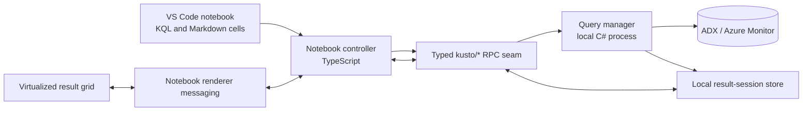

# Investigative Notebook and Scalable Results Plan

## Status

This document records the agreed product choices and the proposed implementation plan for adding a
notebook-based investigation workflow to Kusto Explorer for VS Code.

The plan is intentionally separate from the existing `.kql` editor and `.kqr` result viewer. Those
features remain supported while the notebook workflow is built and evaluated.

Phase 1 was implemented on August 28, 2026. It defines the versioned notebook and result-session
contracts, adds repeatable 100,000-row server and client baseline tools, records service query-text
budgets, and documents the planned ownership and lifecycle seams in `ARCHITECTURE.md`. The contracts
are not wired to runtime handlers until the scalable result-session implementation begins.

## Goals

The new workflow must make it practical to:

1. Write and run KQL in a native VS Code notebook.
2. Inspect approximately 100,000 result rows without freezing the extension host or webview.
3. Apply a separate regular expression filter to each result column.
4. Continue an investigation from the exact locally filtered result when it is safe and practical.
5. Explicitly offer a server-side rerun when an exact snapshot is too large to send back.
6. Create follow-on KQL through right-click enrichment actions.
7. Keep generated queries visible and editable so investigations remain understandable and auditable.

## Confirmed product decisions

### Native notebooks

- Use the native VS Code Notebook API rather than simulating inline results in `.kql` editors.
- Use a dedicated `.kqlnb` file format.
- Support KQL code cells and Markdown cells.
- Display query results inline beneath the cell that produced them.
- Preserve the existing `.kql` query and `.kqr` result experiences.

### Saved notebook contents

- Save KQL cells, Markdown cells, cell order, and non-secret notebook metadata.
- Do not save query result rows by default.
- Reopening a notebook therefore restores the investigation text but requires cells to be run again
  before results appear.
- Never persist access tokens or other credentials in a notebook.

### Regex filtering

- Provide a separate regex filter for every result column.
- Combine active column filters with logical `AND`.
- Run filters against the exact local result snapshot, not against Azure.
- Keep the user interface responsive while a filter is evaluated.
- Show invalid regular expressions as errors instead of treating them as valid filters with no
  matches.

### Follow-on queries

- Prefer the exact filtered snapshot when it can be represented safely in a follow-on query.
- Generate an editable KQL `datatable()` for a snapshot that fits within the target service's query
  text limit.
- If the snapshot is too large, explain why and offer to rerun the source query with equivalent KQL
  filters.
- Require confirmation before changing from exact-snapshot semantics to a live server rerun.
- Never silently claim that a rerun is the same data as the earlier snapshot.

### Initial enrichment actions

The first release will provide general investigation actions:

- Include the selected value.
- Exclude the selected value.
- Open matching rows in a new KQL cell.
- Summarize counts by the selected column.
- Join on the selected value.

Each action creates visible, editable KQL in a new cell. It does not invisibly mutate result rows.
Security-specific and parsing-specific actions can be added later through the same extension point.

## User experience

### Basic execution

1. The user opens or creates a `.kqlnb` notebook.
2. The user selects a Kusto connection and database using the existing connection system.
3. The user writes KQL in a code cell.
4. Running the cell shows execution progress, supports cancellation, and displays results inline.
5. Markdown cells can document assumptions, findings, and next steps between query cells.
6. Rerunning a cell replaces its active result session after the new execution succeeds.

KQL notebook cells must receive the same completion, diagnostics, formatting, hover, and navigation
support as ordinary KQL documents.

### Result grid

The result grid will:

- Render only the visible rows plus a small buffer.
- Request result pages as the user scrolls.
- Preserve Kusto scalar types instead of converting the whole result to display strings up front.
- Support column resize, reorder, sorting, copying, and row or cell selection.
- Show row counts for both the complete snapshot and the currently filtered view.
- Show filter progress and allow an in-progress filter operation to be cancelled.
- Preserve stable row ordering unless the user explicitly sorts.

Proposed initial display defaults:

- Request 200 rows per page.
- Debounce filter edits briefly before evaluation.
- Match case-insensitively by default, with a per-filter case-sensitive option.
- Match against the displayed invariant representation of non-string values.
- Treat null as a distinct empty display value and document that behavior in the filter UI.

These are implementation defaults, not immutable file-format behavior.

### Continuing from filtered results

The notebook will expose a **Continue in new cell** action for selected or filtered rows.

#### Exact snapshot path

When the required rows fit within a safe service-specific text budget:

1. Project only the columns needed by the continuation.
2. Preserve their Kusto scalar types.
3. Escape values through the existing Kusto literal helpers.
4. Generate a new cell containing a `datatable()` named `LocalResult`.
5. Place the cursor after `LocalResult` so the user can add joins, summaries, or other operators.

The size check must use UTF-8 bytes for the complete generated query, not an arbitrary row-count
limit. A few long values can exceed the budget even when the row count is small.

#### Live rerun path

When the exact snapshot does not fit:

1. Explain that the rows cannot be embedded within the service's query-text limit.
2. Offer to generate a query that reruns the original source query.
3. Show the generated KQL filters before execution.
4. State that newly added, removed, or changed server rows may alter the result.
5. Run only after the user confirms.

The generated query should wrap the original query and append supported output-column predicates.
Regex translation must be capability-checked because local .NET regex and Kusto regex do not support
exactly the same syntax. Unsupported expressions must be identified rather than approximated
silently.

### Enrichment actions

Right-click actions receive a typed context containing:

- Result-session identifier.
- Source query and connection provenance.
- Active filters.
- Selected rows, columns, and cell value.
- Kusto type information.

The initial actions behave as follows:

| Action | Generated behavior |
|---|---|
| Include value | Add an equality predicate for the selected column and value. |
| Exclude value | Add an inequality predicate for the selected column and value. |
| Open matching rows | Reopen the source query with a matching predicate, subject to the snapshot/rerun rules above. |
| Summarize counts | Create a query that groups by the selected column and returns counts. |
| Join on value | Ask for a target table and key column, then create an editable join query. |

The registry must decide whether an action applies to the selected type and context. The renderer
only displays actions and reports selections; query construction belongs in testable client-side
logic.

## Architecture

The design preserves the existing two-process architecture and uses the existing LSP/custom
`kusto/*` JSON-RPC channel.

### Notebook components

Add the following client-side components:

- A `NotebookSerializer` for the versioned `.kqlnb` JSON format.
- A `NotebookController` for execution, cancellation, and execution order.
- A notebook result manager that owns renderer messaging and result-session lifetimes.
- A custom notebook output renderer for the virtualized result grid.
- A filter model and enrichment action registry that contain no VS Code webview code.

Add `{ scheme: "vscode-notebook-cell", language: "kusto" }` to the language client document selector
so existing language features work inside KQL cells.

### Notebook file format

The serializer should use an explicitly versioned JSON structure containing:

- Format version.
- Notebook metadata.
- Ordered code and Markdown cells.
- Cell language and source text.
- Stable cell identifiers where required for metadata.
- A non-secret connection reference or enough display metadata to resolve an existing connection.

Outputs are deliberately omitted during serialization. Unknown future metadata should be retained
when possible so a newer notebook is not damaged by an older extension.

### Local result sessions

The current query path materializes the complete result, serializes it through JSON-RPC, copies it
into the extension host, formats every cell, and embeds the full dataset in a webview. That approach
must not be used for notebook-scale results.

Instead, the local C# language-server process will own each result snapshot:

- Read query rows incrementally from the data reader.
- Store each value once in a typed result store.
- Return a result-session identifier and schema instead of returning all rows.
- Expose paged reads, local filtering, local sorting, selection projection, and disposal through the
  existing typed server interface.
- Report execution state and available row counts while results are arriving.
- Dispose sessions when a cell is replaced, a notebook closes, the extension shuts down, or an idle
  retention limit is reached.

The result store should be behind an interface so tests can use a small in-memory implementation.
The production implementation should enforce a memory budget and spill large sessions to a
session-scoped temporary file. The storage format should be selected after benchmarking rather than
committing immediately to Arrow, SQLite, or another dependency.

### Proposed RPC responsibilities

Exact names can follow existing conventions, but the typed seam needs operations equivalent to:

| Operation | Responsibility |
|---|---|
| Start query | Begin execution and return an operation/session identifier. |
| Cancel query | Cancel remote execution and local materialization. |
| Get result status | Return schema, progress, row counts, completion, and errors. |
| Set result view | Apply the complete filter and sort model atomically. |
| Get result page | Return one typed page from the current result view. |
| Get result projection | Return selected rows and columns for copy or continuation. |
| Dispose result | Release memory, temporary files, and related state. |

Requests must be cancellable. A superseded filter or page request must not block the latest request.
The client `IServer`, concrete `Server`, and `NullServer` implementations must remain in agreement.

### Renderer communication

The custom notebook renderer communicates with the extension through VS Code notebook renderer
messaging. It must not call the language server or Azure directly.

The renderer owns:

- Visible grid state.
- Viewport and page requests.
- Selection gestures.
- Column layout.
- Context-menu presentation.
- Accessible status and error messages.

It must not own:

- The complete result dataset.
- Query execution.
- Regex evaluation over all rows.
- KQL generation.
- Connection or authentication state.

### Regex execution

Regex filtering runs in the local C# process against the stored snapshot. This keeps the extension
host and renderer responsive and avoids sending all rows to the webview.

The filter engine must:

- Compile each active column regex once per filter operation.
- Combine active filters with `AND`.
- Use culture-invariant matching.
- Support cancellation when the user edits a filter.
- Apply a bounded regex timeout or a safe non-backtracking mode.
- Return useful errors for unsupported or unsafe expressions.
- Avoid rebuilding formatted strings repeatedly when the same filter is evaluated.
- Keep the prior valid view visible while a replacement filter is invalid or still running.

Filtering locally means no extra Azure query and no change to the captured snapshot.

### Provenance

Every result session must retain:

- Original KQL.
- Cluster and database identity.
- Execution start and completion times.
- Result schema.
- Source notebook and cell identity.
- Active local filter and sort model.
- Whether the query has been rerun since the displayed snapshot was created.

This information is required to generate honest follow-on queries and explain whether an action uses
an exact snapshot or current server data.

## Service constraints

The design must account for different Kusto-compatible services:

- Azure Monitor and Log Analytics impose a practical 64 KB UTF-8 query-text limit.
- Native Azure Data Explorer permits larger queries, but generated queries still need an explicit
  measured budget.
- Query results are also constrained by service row, data-size, and timeout limits.
- Large lists in `in` expressions can lose text-index optimization even before reaching the text
  limit.
- Values embedded in generated query text may appear in service query logs.

Therefore:

- Do not promise that an arbitrary 100,000-row snapshot can be sent back to the service.
- Do not upload temporary data to Blob Storage or ingest it into a workspace in the first release.
- Do not embed credentials or sensitive external-data URLs in generated KQL.
- Warn before putting a large number of potentially sensitive values into query text.
- Prefer predicate replay for large continuations, but only after explicit confirmation.

## Delivery phases

### Phase 1: Contracts and performance baseline

Deliverables:

- Define the versioned `.kqlnb` format.
- Define result-session state, lifecycle, and typed RPC contracts.
- Add a synthetic mixed-type dataset with at least 100,000 rows.
- Measure the current query/result path for time, memory, serialized size, and UI responsiveness.
- Record service-aware generated-query size budgets.
- Update `ARCHITECTURE.md` with the approved notebook and result-session seams.

Exit criteria:

- The protocol can represent execution progress, paging, filtering, cancellation, and disposal.
- Baseline measurements are repeatable.
- No implementation requires putting the complete result into notebook output JSON.

### Phase 2: Native notebook shell

Deliverables:

- Register the `.kqlnb` notebook type.
- Implement serializer and controller.
- Enable KQL language services in notebook cells.
- Reuse existing connection selection and query execution.
- Support Markdown, execution order, progress, errors, and cancellation.
- Serialize cells and metadata without outputs.

Exit criteria:

- A notebook can be created, saved, reopened, and rerun.
- KQL completion and diagnostics work in code cells.
- No access token or result row is written to the notebook file.

### Phase 3: Scalable local result sessions

Deliverables:

- Replace whole-result notebook transport with local result sessions.
- Materialize query rows incrementally into the result-store abstraction.
- Add paged result retrieval and deterministic disposal.
- Build the virtualized notebook grid.
- Support typed display, scrolling, sorting, selection, copying, and column layout.
- Add memory budgeting and temporary-file spill behavior if benchmarks require it.

Exit criteria:

- A 100,000-row mixed-type result can be browsed without a full copy in the renderer.
- Scrolling does not block the extension host.
- Cancelling or closing a notebook releases the result session and temporary storage.

### Phase 4: Per-column regex filtering

Deliverables:

- Add a filter row with one regex input per column.
- Implement the testable filter model and local server evaluator.
- Add cancellation, invalid-pattern errors, timeouts, row counts, and progress.
- Preserve filters while scrolling and when changing column layout.
- Add local filtering tests using the 100,000-row fixture.

Exit criteria:

- Multiple column filters combine with `AND`.
- Filtering does not issue a new Azure query.
- Invalid or pathological regex input cannot freeze the extension or local server.
- The grid remains interactive while filters are replaced or cancelled.

### Phase 5: Snapshot continuation

Deliverables:

- Project selected or filtered rows from a result session.
- Generate typed and correctly escaped `datatable()` KQL.
- Measure complete generated query size in UTF-8 bytes.
- Add service-specific safety budgets.
- Compile supported local filters into KQL predicates.
- Show a confirmation and semantic warning before a live rerun.
- Clearly label generated cells as snapshot-based or rerun-based.

Exit criteria:

- Small snapshots produce valid KQL that represents the exact selected values.
- Oversized snapshots never produce a query known to exceed the service limit.
- A live rerun cannot occur without explicit user confirmation.
- Unsupported regex translations are reported rather than silently changed.

### Phase 6: Enrichment action registry

Deliverables:

- Implement a typed, testable action registry.
- Add include, exclude, matching rows, summarize counts, and join actions.
- Add target table/column selection for join generation.
- Insert generated cells next to the source investigation context.
- Use existing Kusto identifier and literal escaping helpers.

Exit criteria:

- Each action applies only to compatible selections and types.
- Generated KQL is visible and editable before execution.
- Actions obey the same snapshot-size and rerun-confirmation rules.

### Phase 7: Hardening and release

Deliverables:

- Accessibility and keyboard-navigation review.
- Large-result and cancellation integration tests.
- Session cleanup, crash recovery, and stale-message tests.
- Real ADX and scoped Log Analytics smoke tests.
- User documentation for notebooks, filtering, continuation semantics, and privacy warnings.
- Telemetry limited to non-sensitive performance and failure information, following repository
  policy.

Exit criteria:

- Existing `.kql` and `.kqr` tests continue to pass.
- Notebook behavior is reliable for the target dataset.
- Temporary result data is removed after disposal.
- Documentation clearly distinguishes local snapshots from live reruns.

## Performance and reliability targets

Use a reference fixture of at least 100,000 rows and 20 mixed-type columns. Initial engineering
targets are:

- No complete result copy in the notebook renderer.
- No complete result copy in the TypeScript extension host.
- Render the first available page without waiting for display formatting of all rows.
- Keep scrolling and selection responsive while rows are still arriving.
- Complete a typical single-column regex filter over 100,000 rows in approximately one second on a
  development machine.
- Cancel or supersede an active filter promptly.
- Bound renderer memory to visible pages, cached adjacent pages, and grid metadata.
- Bound local result-session memory and spill excess data rather than risking process exhaustion.
- Reject stale page and filter responses by result-session and view revision.

These are targets to validate with benchmarks, not reasons to hide errors or return incomplete data.

## Testing strategy

### C# server tests

- Incremental materialization and type preservation.
- Page boundaries and stable ordering.
- Multiple per-column filters with `AND` semantics.
- Null, dynamic, datetime, numeric, and string matching.
- Invalid, timed-out, cancelled, and superseded regex operations.
- Session disposal and temporary-file cleanup.
- Snapshot projection and UTF-8 query-size calculation.

### TypeScript unit tests

- Notebook serialization and output omission.
- Connection metadata restoration.
- Execution state transitions and cancellation.
- Filter-model revision handling.
- Renderer message validation.
- KQL generation for every enrichment action.
- Exact-snapshot versus live-rerun prompts and labels.

### Integration tests

- KQL language features inside notebook cells.
- Notebook save, reopen, and rerun.
- Progressive result paging.
- A 100,000-row result with filtering, sorting, copying, and selection.
- Closing and rerunning cells while operations are active.
- Ordinary ADX and scoped Azure Monitor connections.
- Regression coverage for existing `.kql` and `.kqr` behavior.

## Security and privacy

- Treat result snapshots as potentially sensitive.
- Keep temporary result files inside session-scoped storage with restrictive access.
- Remove temporary files when their session is disposed and on recovery from an unclean shutdown.
- Validate all renderer messages; the webview is not a trusted data source.
- Escape Kusto identifiers and literals with shared helpers.
- Never put authentication material in renderer messages, notebook files, generated KQL, or
  temporary result metadata.
- Warn that values embedded in `datatable()` or `in (...)` query text may be retained in service
  query logs.
- Do not introduce automatic Blob Storage upload, external data, or workspace ingestion as a hidden
  fallback.

## Compatibility and migration

- Existing `.kql` files continue to use the current editor and result viewer.
- Existing `.kqr` files continue to preserve saved result snapshots.
- Notebook support is additive; no automatic conversion is required initially.
- A later command may convert a `.kql` document into notebook cells, but it is outside the first
  release.
- Existing result table behavior should be reused where practical, but the current
  `simple-datatables` webview is not the foundation for the 100,000-row notebook grid.

## Explicitly deferred work

The first release will not include:

- Persisted notebook outputs.
- Automatic upload to Azure Blob Storage.
- Ingestion into Log Analytics custom tables.
- Transparent batching of many follow-on Azure queries.
- Collaborative notebook execution.
- A webview framework migration.
- Security-specific IP, user, or host enrichment packs.
- JSON, URL, or regex-group parsing enrichment packs.
- Arrow transport unless JSON page measurements show that it is necessary.

## Relevant implementation areas

- `src/Client/extension.ts` - notebook registration, composition, and language-client selector.
- `src/Client/features/server.ts` - typed result-session RPC contract.
- `src/Client/features/queryEditor.ts` - existing execution behavior to reuse without coupling the
  notebook to the editor UI.
- `src/Client/features/resultsViewer.ts` - existing result provenance and compatibility behavior.
- `src/Client/features/dataTableProvider.ts` - behavior worth preserving, but not the scalable grid
  foundation.
- `src/Server/Server.cs` - custom `kusto/*` handlers.
- `src/Server/Connections/ConnectionManager.cs` - query execution and current materialization
  boundary.
- `src/Server/Utilities/ResultData.cs` - current serializable result representation.
- `ARCHITECTURE.md` - architectural contract that must be updated when implementation begins.

## References

- [VS Code Notebook API](https://code.visualstudio.com/api/extension-guides/notebook)
- [VS Code notebook output renderer API](https://code.visualstudio.com/api/extension-guides/notebook#notebook-renderer)
- [Kusto query limits](https://learn.microsoft.com/kusto/concepts/query-limits)
- [Azure Monitor service limits](https://learn.microsoft.com/azure/azure-monitor/fundamentals/service-limits)
- [Kusto `datatable` operator](https://learn.microsoft.com/kusto/query/datatable-operator)
- [Kusto string operators](https://learn.microsoft.com/kusto/query/datatypes-string-operators)
- [Kusto query best practices](https://learn.microsoft.com/kusto/query/best-practices)
